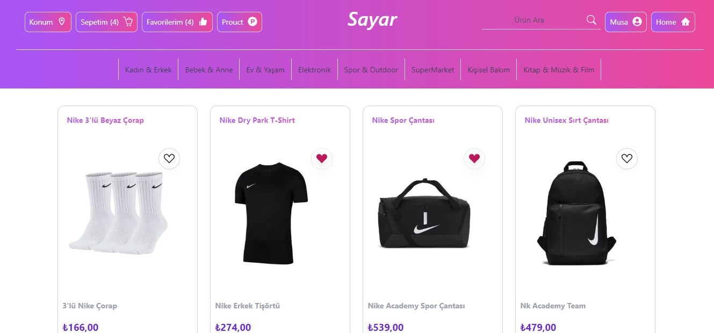
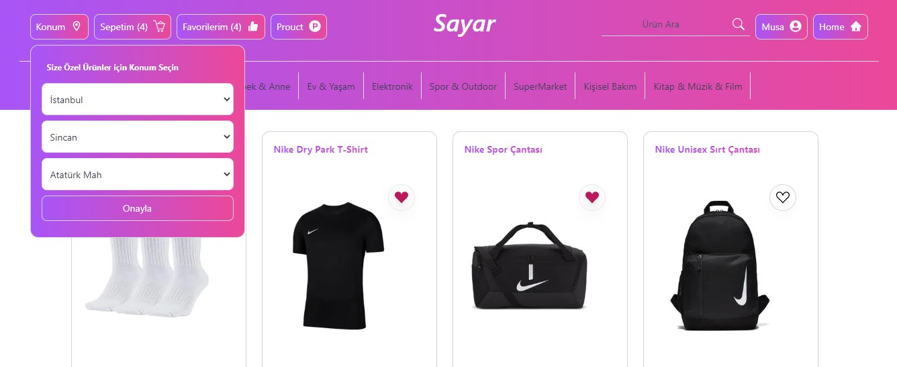
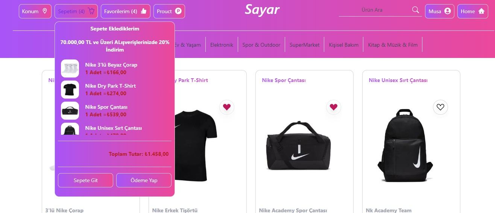
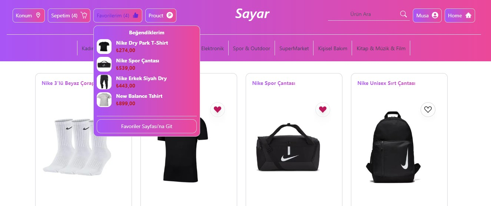
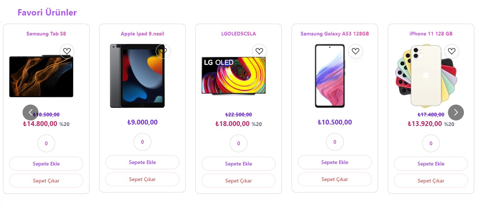
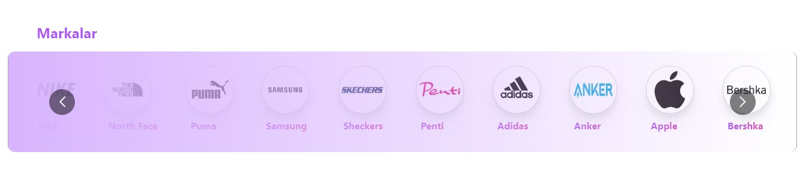
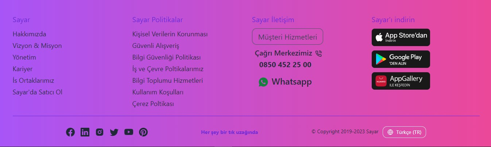

# Sayar  Commerce

Bu projemizde e-ticaret sitesi yaptık. Bu projede ürünleri sepete ekleme, ürünleri sepet den çıkarma, beğenilen ürünleri favorilere ekleme ve çıkarma gibi işlemler react.js kullanılarak yapıldı. Bu projede kendi Api'lerimizi oluşturarak  bu api'ler üzerinden  veri çekme  işlemlerini gerçekleştirdik. Bu projede state yönetimini  react'ın Context  yapısı üzerinden gerçekleştirdik. 

React-Multi-Carousel kullanarak markalar ve favori ürünlerimizi carousel yapısı içerinde oluşturduk.

Proje tasarımını tailwindcss ile gerçekleştirdik. Proje bilgisayar, tablet ve mobile uygun olarak responsive tasarımını yaptık. 

## Sayfa Yapısı

Aşağıdaki resimde'de görüldüğü gibi kullanıcı konum başlığına tıkladığında açılan alandan kendi konum bilgisini girebilecek.

Kullanıcı sepete eklediği ürünleri sepetim başlığı üzerine tıkladığında açılan alandan görebilecek.

Kullanıcı beğendiği ürünleri'de favorilerim başlığına tıkladığında açılan alandan beğendiği ürünleri görebilecek.

Markalar ve favori ürünler Carousel yapısı içinde kullanıcıya gösteriliyor.

Sayfanın en sonunda footer alanımız yer almaktadır.

### Proje içerisinde kullanılan Teknolojiler;

1. React.js
2. Tailwindcss

### Proje içerisinde kullanılan npm paketleri

1. react-multi-carousel
2. react-slick
3. react-toastifty
4. react-icons
5. tailwincss
6. useWindowSize

### Authors:

Musa SAYAR

